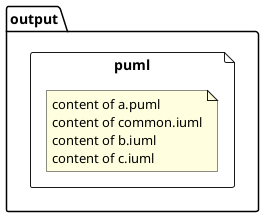

# plantumlInliner

This is a small script that will help to merge all subsequent PlantUML-files that are included by the **!include**-directive.

Usually, I work with an object oriented approach of define once and use everywhere for my PlantUML definition of components and sequences. So, sometimes a single file includes 5, 10 or 50 other files. However, sometimes I need a single file that I can share with someone or even use with the PlantUML Confluence plugin. This script does the job for me.

There are no frills and no guarantee. It worked for me with Python 3.8.2

## Usage

**python.exe inliner.py** **--path** _"c:/path/to/folder/"_ **--input** _rootFile.puml_ **--output** _output.puml_ 

## Example

There is a tiny example in the (manual) test folder.

### Given

4 files a.puml, b.iuml, c.iuml and common.iuml.
```
$ tree
.
├── a.iuml
└── b/
|   ├── b.puml
|   └── c/
|       └── c.puml
└── common.iuml
```
Where common.iuml has information such as variables, functions or whatever needed in any other file.
a.puml includes common.iuml and b.iuml, which e.g. contains another compont and functions related to that component. The same goes for c.iuml.

### Result

1 file with all data from the 4 files above in hopefully the correct order, which is necessary for **!functions**, and only once included, which is important if you have defined a **!final function**.

